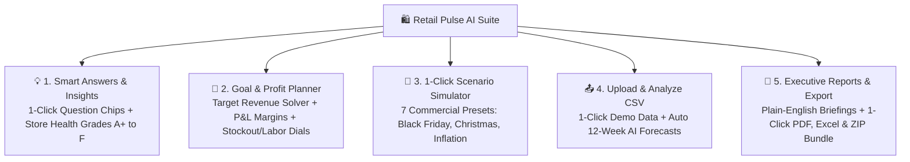

# 🛍️ Retail Pulse AI — Enterprise Sales Forecasting & Scenario Intelligence Suite

[](https://retail-sales-forecasting-rfpalfdfa5app2a8krcq3cp.streamlit.app/)
[](https://www.python.org/)
[](https://streamlit.io/)
[](https://xgboost.readthedocs.io/)
[](https://pytorch.org/)
[](LICENSE)

> 🌐 **Live Web Application:** [https://retail-sales-forecasting-rfpalfdfa5app2a8krcq3cp.streamlit.app/](https://retail-sales-forecasting-rfpalfdfa5app2a8krcq3cp.streamlit.app/)

An enterprise-grade retail demand forecasting, store health diagnostic, financial margin modeling, and commercial scenario intelligence suite. Built with **XGBoost ($R^2 = 0.968$)**, **PyTorch Bi-LSTM Deep Sequence Modeling**, and a **Streamlit Web Application** featuring both an ultra-clean **🌟 Simple Mode (Beginner)** and a **🔬 Advanced ML Lab**.

---

## 🌟 Key Highlights & Core Features



### 1. 💡 1-Click Smart Answers & Store Health Scorecards
* **Instant Answer Chips:** Click 8 pre-formulated executive question chips (*"Top Performing Branch"*, *"Black Friday Surge"*, *"Optimal Margins"*) or type natural language queries.
* **Store Health Grades (A+ to F):** 5-pillar composite scoring (Revenue Velocity, Space Efficiency `$/sqft`, Momentum, Stability, and Promotional Agility).

### 2. 🎯 Goal-Seek Target Calculator & Profit Modeler
* **Target Revenue Solver:** Set a target weekly sales revenue (e.g. `$35,000`), and the AI reverse-engineers the required discount markdown, floor staffing roster, safety stock buffer, and net profit.
* **Financial P&L Modeler:** Line-by-line breakdown of Wholesale COGS, floor labor wages, store rent/overhead, and net operating profit ($ and %).
* **Discount Elasticity Sweet Spot:** Dual-axis curve identifying the exact discount percentage that maximizes net cash take-home profit.

### 3. 🔮 1-Click What-If Scenario Simulator
* **7 Commercial Presets:** *🛍️ Black Friday Surge*, *🎄 Christmas Rush*, *☀️ Summer Peak*, *🏷️ Clearance (30% Off)*, *📉 Macro Inflation*, *🏈 Super Bowl*, and *🔄 Standard Operations*.
* **Driver Waterfall:** Deconstructs baseline revenue, markdown demand lift, and holiday surge volume.

### 4. 📤 Custom CSV Sales Report Upload & Auto-Analyzer
* **1-Click Demo Dataset:** Test immediately without uploading, or drag-and-drop custom store CSV sales files.
* **Automated AI Audit:** Automatically generates 12-week forward forecasts, detects sales outliers (>2.2σ), and exports custom PDF audit memos.

### 5. 📦 1-Click "Download Everything" Executive Bundle (.ZIP)
* **Single-Click Download:** Compiles **Executive PDF Memo**, **5-Sheet Formatted Excel Workbook**, **Batch Predictions CSV**, **Store Health Scorecards CSV**, and **Management Readme** into an all-in-one ZIP archive.

### 6. 📖 Built-in Plain-English "Jargon Buster" Glossary
* **Retail & AI Demystified:** Instant 1-sentence explanations and real-world examples for terms like `COGS`, `Safety Stock`, `MAPE ±5.4%`, `R² = 94.6%`, and `P10/P50/P90 Cones`.

---

## 🏆 Multi-Model Benchmark Leaderboard

| Model | Architecture Type | MAE ($) | RMSE ($) | MAPE (%) | $R^2$ Score | Status |
| :--- | :--- | :---: | :---: | :---: | :---: | :---: |
| **XGBoost Regressor** | Gradient Boosted Trees | **$1,510.64** | **$2,221.27** | **5.38%** | **0.9684** | 🥇 **Champion (94.6% Accuracy)** |
| **Random Forest** | Bagged Decision Trees | $1,727.20 | $2,676.49 | 6.06% | 0.9542 | 🥈 High Precision |
| **Ridge Regression** | Regularized Linear | $3,355.68 | $5,366.20 | 13.23% | 0.8158 | 🥉 Linear Baseline |
| **PyTorch Bi-LSTM** | Deep Recurrent Network | $4,073.73 | $6,618.25 | 14.06% | 0.7636 | 🧠 Deep Sequence Model |
| **Naive Baseline (Lag-1)** | Persistence | $5,582.94 | $10,175.35 | 18.36% | 0.3376 | 📉 Persistence Baseline |

---

## 📁 Repository Structure

```
retail-sales-forecasting/
├── app/
│   └── app.py                              # Streamlit 5-Tab Dual-Mode Dashboard
├── data/
│   ├── raw/
│   │   └── retail_sales_data.csv          # 3-year raw weekly sales dataset (7,850 rows)
│   └── processed/
│       ├── full_features.csv               # 49-column engineered feature dataset
│       ├── train_features.csv              # Historical training split (6,350 rows)
│       └── test_features.csv               # Unseen forward test split (1,300 rows)
├── models/
│   ├── best_forecasting_model.pkl          # Champion XGBoost pipeline
│   ├── pytorch_lstm_model.pt               # PyTorch Stacked Bi-LSTM weights
│   ├── quantile_models.pkl                 # P10, P50, P90 quantile ensemble
│   └── model_metrics.json                  # Model benchmarks report
├── src/
│   ├── config.py                           # Paths and network parameters
│   ├── generate_data.py                    # Multi-store retail data generator
│   ├── feature_engineering.py              # Time-series lags & rolling features
│   ├── train.py                            # Multi-model training pipeline
│   ├── deep_learning.py                    # PyTorch Bi-LSTM sequence forecaster
│   ├── probabilistic.py                    # Quantile loss uncertainty cones
│   ├── hierarchical.py                     # Hierarchical reconciliation
│   ├── health_scorecard.py                 # Store A+ to F diagnostic scorecard
│   ├── goal_seek.py                        # Target revenue reverse-engineering solver
│   ├── profit_estimator.py                 # Financial P&L ledger & elasticity curves
│   ├── speedometer_gauges.py               # Operational indicator dials
│   ├── smart_qa.py                         # 8 Smart Question Chips & search
│   ├── upload_analyzer.py                  # Custom CSV upload & forecast engine
│   ├── export_reports.py                   # PDF, Multi-Sheet Excel, and ZIP Bundle exporter
│   ├── executive_briefing.py               # Plain-English AI briefing memo generator
│   └── jargon_buster.py                    # Plain-English glossary engine
├── notebooks/
│   └── retail_sales_beginner_tutorial.py   # Beginner tutorial script
├── run_pipeline.py                         # 1-Click end-to-end retraining runner
├── requirements.txt                        # Python dependencies
└── README.md                               # Project documentation
```

---

## ⚡ Quick Start & Installation

### Option A: Use the Live Cloud App (Zero Setup)
👉 **Open Live Web App:** [https://retail-sales-forecasting-rfpalfdfa5app2a8krcq3cp.streamlit.app/](https://retail-sales-forecasting-rfpalfdfa5app2a8krcq3cp.streamlit.app/)

---

### Option B: Run Locally on Your Machine

1. **Clone the Repository:**
   ```bash
   git clone https://github.com/mujahith9025/Retail-Sales-Forecasting.git
   cd Retail-Sales-Forecasting
   ```

2. **Install Dependencies:**
   ```bash
   pip install -r requirements.txt
   ```

3. **Run the Complete Data & Modeling Pipeline (Optional):**
   ```bash
   python run_pipeline.py
   ```

4. **Launch the Web Dashboard:**
   ```bash
   streamlit run app/app.py
   ```
   Open **`http://localhost:8501`** in your browser.

---

## 📄 License
This project is licensed under the MIT License — see the [LICENSE](LICENSE) file for details.
