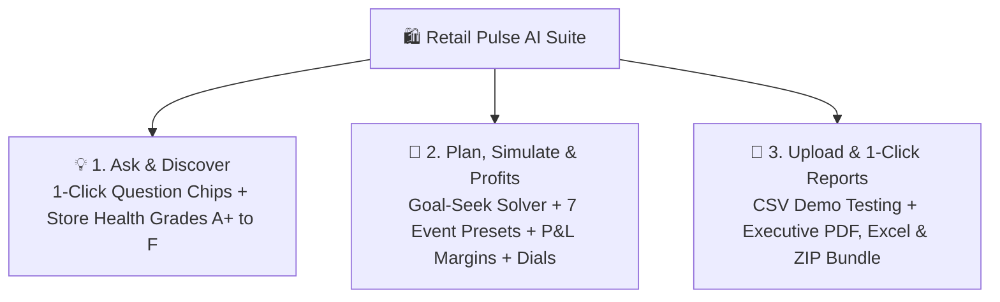

# 🛍️ Retail Pulse AI — Enterprise Sales Forecasting & Scenario Intelligence Suite

[](https://retail-sales-forecasting-rfpalfdfa5app2a8krcq3cp.streamlit.app/)
[](https://www.python.org/)
[](https://streamlit.io/)
[](https://xgboost.readthedocs.io/)
[](https://pytorch.org/)
[](LICENSE)

> 🌐 **Live Web Application:** [https://retail-sales-forecasting-rfpalfdfa5app2a8krcq3cp.streamlit.app/](https://retail-sales-forecasting-rfpalfdfa5app2a8krcq3cp.streamlit.app/)

An enterprise-grade retail demand forecasting, store health diagnostic, financial margin modeling, and commercial scenario intelligence suite. Built with **XGBoost ($R^2 = 0.968$)**, **PyTorch Bi-LSTM Deep Sequence Modeling**, and a **Streamlit Web Application** featuring both an ultra-clean **🌟 Simple Mode (Beginner)** and a **🔬 Advanced ML Lab**.

---

## 🌟 Key Highlights & Core Features



### 1. 🧭 "What Do You Want to Do?" 1-Click Executive Decision Wizard
* **Instant Intent Cards:** 6 high-level commercial intents (*"Hit a Revenue Target"*, *"Prepare for Holiday Surge"*, *"Audit Store Health Grades"*, *"Maximize Cash Profits"*, *"Forecast Custom CSV"*, *"Export Executive Briefing"*).
* **Live Action Directives:** Instantly calculates the exact 3-step action plan, expected revenue, required discount, labor hours, and safety buffers.

### 2. 🏢 Interactive Visual Store Card Deck (Goodbye Boring Dropdowns)
* **Visual City Cards:** Browse and click 10 branch cards (🗽 New York, 🌴 Los Angeles, 🏆 Dallas, 🚀 Houston, etc.) featuring live letter grades (A+ to F), sales efficiency (`$/sq ft`), and active selection glowing borders.
* **Global State Sync:** Selecting any branch card instantly synchronizes the entire platform across diagnostic scorecards, goal-seek calculators, and scenario simulations.

### 3. 🩺 5-Pillar Battery Meters & Health Scorecards
* **Visual Battery Meters:** Animated progress meters for **Revenue Velocity (25 pts)**, **Footprint Efficiency (20 pts)**, **Growth Momentum (20 pts)**, **Forecast Stability (20 pts)**, and **Promo Agility (15 pts)**.
* **1-Sentence Action Pill:** Crisp, executive directive strictly under 10 words (e.g. *💡 Restock Grocery inventory to sustain +4.2% growth*).

### 4. 🎯 Goal-Seek Feasibility Dial & 4 Pictorial Metric Boxes
* **Visual Feasibility Dial (0-100%):** Color-coded semi-circle radial gauge (Green = Easy, Blue = Moderate, Amber = Stretch, Red = Moonshot).
* **4 Pictorial Metric Boxes:** Instant visual breakdown of **Required Markdown (% Off)**, **Extra Floor Staff (👥)**, **Restock Boxes Buffer (📦)**, and **Net Cash Profit ($ & %)**.

### 5. 💰 Visual Cash Flow Stepper & P&L Waterfall
* **Cash Flow Stepper Bar:** Visual step-down chain (*💵 Register Sales ➔ 📦 -COGS ➔ 👥 -Labor ➔ 🏢 -Rent/OPEX ➔ 💰 = Net Cash Profit*).
* **Financial P&L Waterfall:** Color-coded Plotly step-down waterfall decomposing wholesale COGS, associate floor wages, and net EBITDA margins.

### 6. 🎮 Dynamic Real-Time Slider Feedback (Gamified Interaction)
* **Live Micro-Badges:** Instant feedback as you drag discount sliders, revenue goals, and inflation indices:
  - *🔥 Margin Sweet Spot (5-10% promo):* Displays maximum net cash profit warnings vs. margin dilution.
  - *🎯 Goal Target Rating:* Evaluates feasibility from *🟢 Easy Baseline* to *🚀 Moonshot Surge*.
  - *📈 Macro Health Bar:* Evaluates combined gas prices, CPI inflation, and unemployment stress.

### 6. 🔮 1-Click What-If Scenario Simulator
* **7 Commercial Presets:** *🛍️ Black Friday Surge*, *🎄 Christmas Rush*, *☀️ Summer Peak*, *🏷️ Clearance (30% Off)*, *📉 Macro Inflation*, *🏈 Super Bowl*, and *🔄 Standard Operations*.
* **Driver Waterfall:** Deconstructs baseline revenue, markdown demand lift, and holiday surge volume.

### 7. 📤 Custom CSV Sales Report Upload & Auto-Analyzer
* **1-Click Demo Dataset:** Test immediately without uploading, or drag-and-drop custom store CSV sales files.
* **Automated AI Audit:** Automatically generates 12-week forward forecasts, detects sales outliers (>2.2σ), and exports custom PDF audit memos.

### 8. 📦 1-Click "Download Everything" Executive Bundle (.ZIP)
* **Single-Click Download:** Compiles **Executive PDF Memo**, **5-Sheet Formatted Excel Workbook**, **Batch Predictions CSV**, **Store Health Scorecards CSV**, and **Management Readme** into an all-in-one ZIP archive.

### 9. 📖 Built-in Plain-English "Jargon Buster" Glossary
* **Retail & AI Demystified:** Instant 1-sentence explanations and real-world examples for terms like `COGS`, `Safety Stock`, `MAPE ±5.4%`, `R² = 94.6%`, and `P10/P50/P90 Cones`.

### 10. ⚓ Floating Bottom Action Bar (Mobile & Desktop Friendly)
* **Persistent Glassmorphic Dock:** Fixed at the bottom of the screen with active store indicator (`🏆 Dallas, TX`), live model accuracy telemetry (`🟢 94.6% Accuracy`), and quick actions on any screen size.

### 11. 💡 Glowing Floating Segmented Tabs
* **Aesthetic Navigation:** Frosted glass segmented controller with glowing blue active badges, hover elevations, and responsive segmented radio selectors.

---

## 🏆 Multi-Model Benchmark Leaderboard

| Model | Architecture Type | MAE ($) | RMSE ($) | MAPE (%) | $R^2$ Score | Status |
| :--- | :--- | :---: | :---: | :---: | :---: | :---: |
| **XGBoost Regressor** | Gradient Boosted Trees | **$1,510.64** | **$2,221.27** | **5.38%** | **0.9684** | 🥇 **Champion (94.6% Accuracy)** |
| **Random Forest** | Bagged Decision Trees | $1,727.20 | $2,676.49 | 6.06% | 0.9542 | 🥈 High Precision |
| **Ridge Regression** | Regularized Linear | $3,355.68 | $5,366.20 | 13.23% | 0.8158 | 🥉 Linear Baseline |
| **PyTorch Bi-LSTM** | Deep Recurrent Network | $4,073.73 | $6,618.25 | 14.06% | 0.7636 | 🧠 Deep Sequence Model |
| **Naive Baseline (Lag-1)** | Persistence | $5,582.94 | $10,175.35 | 18.36% | 0.3376 | 📉 Persistence Baseline |

---

## 📁 Repository Structure

```
retail-sales-forecasting/
├── app/
│   └── app.py                              # Streamlit 5-Tab Dual-Mode Dashboard
├── data/
│   ├── raw/
│   │   └── retail_sales_data.csv          # 3-year raw weekly sales dataset (7,850 rows)
│   └── processed/
│       ├── full_features.csv               # 49-column engineered feature dataset
│       ├── train_features.csv              # Historical training split (6,350 rows)
│       └── test_features.csv               # Unseen forward test split (1,300 rows)
├── models/
│   ├── best_forecasting_model.pkl          # Champion XGBoost pipeline
│   ├── pytorch_lstm_model.pt               # PyTorch Stacked Bi-LSTM weights
│   ├── quantile_models.pkl                 # P10, P50, P90 quantile ensemble
│   └── model_metrics.json                  # Model benchmarks report
├── src/
│   ├── config.py                           # Paths and network parameters
│   ├── generate_data.py                    # Multi-store retail data generator
│   ├── feature_engineering.py              # Time-series lags & rolling features
│   ├── train.py                            # Multi-model training pipeline
│   ├── deep_learning.py                    # PyTorch Bi-LSTM sequence forecaster
│   ├── probabilistic.py                    # Quantile loss uncertainty cones
│   ├── hierarchical.py                     # Hierarchical reconciliation
│   ├── store_deck.py                       # Interactive visual store card deck engine
│   ├── decision_wizard.py                  # 1-Click executive decision wizard engine
│   ├── gamified_feedback.py                # Dynamic real-time slider feedback badges
│   ├── health_scorecard.py                 # Store A+ to F diagnostic scorecard
│   ├── goal_seek.py                        # Target revenue reverse-engineering solver
│   ├── profit_estimator.py                 # Financial P&L ledger & elasticity curves
│   ├── speedometer_gauges.py               # Operational indicator dials
│   ├── smart_qa.py                         # 8 Smart Question Chips & search
│   ├── upload_analyzer.py                  # Custom CSV upload & forecast engine
│   ├── export_reports.py                   # PDF, Multi-Sheet Excel, and ZIP Bundle exporter
│   ├── executive_briefing.py               # Plain-English AI briefing memo generator
│   ├── jargon_buster.py                    # Plain-English glossary engine
│   └── floating_bar.py                     # Floating bottom action bar engine
├── notebooks/
│   └── retail_sales_beginner_tutorial.py   # Beginner tutorial script
├── run_pipeline.py                         # 1-Click end-to-end retraining runner
├── requirements.txt                        # Python dependencies
└── README.md                               # Project documentation
```

---

## ⚡ Quick Start & Installation

### Option A: Use the Live Cloud App (Zero Setup)
👉 **Open Live Web App:** [https://retail-sales-forecasting-rfpalfdfa5app2a8krcq3cp.streamlit.app/](https://retail-sales-forecasting-rfpalfdfa5app2a8krcq3cp.streamlit.app/)

---

### Option B: Run Locally on Your Machine

1. **Clone the Repository:**
   ```bash
   git clone https://github.com/mujahith9025/Retail-Sales-Forecasting.git
   cd Retail-Sales-Forecasting
   ```

2. **Install Dependencies:**
   ```bash
   pip install -r requirements.txt
   ```

3. **Run the Complete Data & Modeling Pipeline (Optional):**
   ```bash
   python run_pipeline.py
   ```

4. **Launch the Web Dashboard:**
   ```bash
   streamlit run app/app.py
   ```
   Open **`http://localhost:8501`** in your browser.

---

## 📄 License
This project is licensed under the MIT License — see the [LICENSE](LICENSE) file for details.
